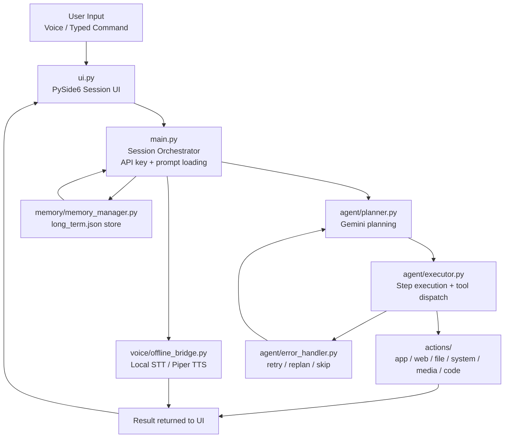

# OMINI Assistant AI

OMINI is a voice-first desktop assistant built around a Gemini-powered live conversation loop, a PySide6 desktop UI, a local memory store, and a modular action system for system control, browsing, file operations, reminders, media, and custom code execution.

The project runs in two modes:

- Online mode: live voice interaction through Gemini
- Offline fallback: local STT and TTS through the offline bridge when internet is unavailable

---

## What It Does

OMINI listens to spoken or typed commands, routes them through the assistant prompt, decides which tool to call, executes the action, and then responds through the UI and voice output.

Current capabilities include:

- Opening applications and websites
- Web search and comparison queries
- Weather and flight lookup
- Messaging actions
- Reminders and scheduled tasks
- File and desktop operations
- Browser and screen control
- System settings such as volume, brightness, and window management
- Game management helpers
- Code generation, execution, and developer-agent workflows
- Persistent long-term memory for user facts and preferences

---

## Runtime Flow

1. `main.py` creates the `OminiUI` window from `ui.py`.
2. The assistant reads the Gemini API key from `config/api_keys.json`.
3. The system prompt is loaded from `core/prompt.txt`.
4. User input is accepted from the UI or from the live voice pipeline.
5. `agent/planner.py` turns the request into a structured plan.
6. `agent/executor.py` dispatches the plan to the matching tool in `actions/`.
7. `agent/error_handler.py` decides whether to retry, skip, replan, or abort when a step fails.
8. `memory/memory_manager.py` loads and updates long-term memory in `memory/long_term.json`.
9. If internet is unavailable, `voice/offline_bridge.py` records audio locally, transcribes it with local STT when available, and speaks with local TTS.

---

## Architecture



### Architecture Notes

- `ui.py` is the presentation layer. It owns the visible session, input handling, and state display.
- `main.py` is the controller. It loads `config/api_keys.json`, reads `core/prompt.txt`, wires the UI, and runs the assistant loop.
- `agent/planner.py` turns a goal into a structured plan using Gemini.
- `agent/executor.py` resolves each step to a concrete module in `actions/`.
- `agent/error_handler.py` handles failed steps by choosing retry, skip, replan, or abort.
- `memory/memory_manager.py` keeps persistent context in `memory/long_term.json` and injects it into the prompt.
- `voice/offline_bridge.py` keeps speech input and output available when internet access is unavailable.

### Workflow

1. The user speaks or types a command into the UI.
2. `main.py` normalizes the input and starts a live assistant turn.
3. The planner generates a structured goal plan.
4. The executor maps each step to the matching action module.
5. The selected action runs and returns a result.
6. The result is spoken back and shown in the UI.
7. If a step fails, the error handler decides the recovery path.
8. Memory is updated so future turns can reuse saved context.
9. If connectivity drops, the offline bridge handles local STT and TTS.

---

## Project Structure

```text
OMINI_ASSISTANT_AI/
├── main.py                  # Entry point and live assistant loop
├── ui.py                    # PySide6 desktop UI
├── readme.md
├── requirements.txt
├── setup.py                 # Convenience installer
├── config/
│   └── api_keys.json        # Gemini API key and related config
├── core/
│   └── prompt.txt           # System prompt used by the assistant
├── actions/
│   ├── open_app.py
│   ├── web_search.py
│   ├── browser_control.py
│   ├── file_controller.py
│   ├── computer_settings.py
│   ├── computer_control.py
│   ├── desktop.py
│   ├── send_message.py
│   ├── reminder.py
│   ├── weather_report.py
│   ├── flight_finder.py
│   ├── youtube_video.py
│   ├── game_updater.py
│   ├── screen_processor.py
│   ├── code_helper.py
│   └── dev_agent.py
├── agent/
│   ├── planner.py
│   ├── executor.py
│   ├── error_handler.py
│   └── task_queue.py
├── memory/
│   ├── memory_manager.py
│   ├── config_manager.py
│   └── long_term.json
└── voice/
    ├── offline_bridge.py
    ├── input/
    │   └── recorder.py
    ├── stt/
    │   ├── faster_whisper_engine.py
    │   └── whisper_engine.py
    └── tts/
        ├── tts_engine.py
        └── piper/
```

---

## How the Assistant Works

### Input and control

The assistant accepts commands from the desktop UI and from the voice loop. The UI is built with PySide6 and includes typed command entry, status display, and controls for the live session.

### Planning and execution

The planner asks Gemini to produce a structured JSON plan. The executor then maps each step to a concrete action module. When a step fails, the error handler decides whether the assistant should retry the step, skip it, replan, or stop.

### Memory

Long-term memory is stored locally in `memory/long_term.json`. The memory manager groups facts into categories such as identity, preferences, projects, relationships, wishes, and notes, then injects relevant context into the assistant prompt.

### Offline fallback

When internet access is unavailable, the assistant switches to the offline bridge. That path records a short audio chunk, transcribes it using a local Whisper backend when available, and uses Piper TTS for spoken output. Queued offline turns are replayed when connectivity returns.

---

## Supported Actions

The `actions/` folder contains the real workhorses of the assistant. The most important ones are:

- `open_app.py` for launching applications
- `web_search.py` for Gemini or DuckDuckGo-backed search
- `browser_control.py` for browser automation
- `file_controller.py` for safe file and folder operations
- `computer_settings.py` for volume, brightness, and window-level controls
- `computer_control.py` for low-level input automation
- `desktop.py` for desktop organization tasks
- `send_message.py` for messaging flows
- `reminder.py` for scheduled reminders
- `screen_processor.py` for screen or camera analysis
- `game_updater.py` for game update and install workflows
- `code_helper.py` for code generation, editing, and execution
- `dev_agent.py` for larger development-oriented tasks

---

## Setup

### Requirements

- Python 3.10+
- Windows recommended for the full desktop experience
- A valid Gemini API key in `config/api_keys.json`
- Optional local speech packages for offline mode: `faster-whisper`, `openai-whisper`, and `piper`

### Install

```bash
python -m pip install -r requirements.txt
python -m playwright install
```

If you prefer the bundled setup script:

```bash
python setup.py
```

### Configure

- Put your Gemini API key in `config/api_keys.json`
- Review the system prompt in `core/prompt.txt`
- Check `memory/long_term.json` if you want to inspect or reset saved context

---

## Run

```bash
python main.py
```

The UI should launch and the assistant will initialize its live session. If the network is unavailable, the offline bridge is used automatically.

---

## Example Commands

```text
Open Chrome
Search for mechanical engineering careers
Create a folder called Projects on the desktop
Set volume to 30 percent
Remember that my manager name is Priya
Recall manager name
Send a message to John saying I will be late
What is the weather in Istanbul
Find flights from London to Dubai next Friday
Analyze my screen
```

---

## Notes

- The assistant is built around a tool-calling workflow rather than a fixed chat script.
- `generated_code` is available as a fallback path when no direct tool fits the task.
- Some automation features are OS-dependent, especially the low-level system control tools.
- The repository currently stores configuration and memory locally rather than in a remote backend.

---

## Troubleshooting

- If startup fails, check that `config/api_keys.json` exists and contains a valid Gemini key.
- If voice input does not work, verify your microphone permissions and the installed audio dependencies.
- If offline mode is not available, install the local STT/TTS packages referenced by the voice modules.
- If a file or system action behaves unexpectedly, check the corresponding module in `actions/` and the logs printed by the executor.
